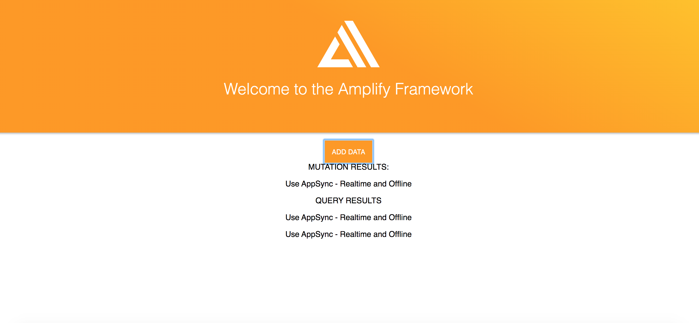

# Amplify Tutorial

## Getting Started
https://docs.amplify.aws/start/getting-started/installation/q/integration/js  

해당 tutorial은 ToDo Schema에 대해 GraphQL의 3가지 operation(Create(mutation), List(query), Subscription)을 Javascript App(frontend)을 통해서 하는 예제  

1. tutorial에 맞게 AWS 가입 및 `amplify configure` 설정  
2. Javascript 앱 생성  
> package.json index.html webpack.config.js src/app.js 4가지 파일 복붙  
package.json : 앱에서 사용할 dependency  
index.html : 브라우저에서 localhost:8080 접근시 보여주는 html  
webpack.config.js : 앱 webpack 설정  
src/app.js : amplify를 통해 만든 graphQL(mutation, query, subscription) 코드를 호출하는 함수 작성  
3. `npm install` `npm start` (localhost:8080이 잘되는지 확인)
4. `amplify init`을 통해 amplify 설정
5. `amplify add api`를 통해 appSync api 등록
> 여기서 GraphQL의 Schema(ToDo)를 등록(Dynamo DB에 table로 등록됨)
```
type Todo @model {
  id: ID!
  name: String!
  description: String
}
```
> !는 required field  
> @model을 해주게되면 Table에 대해 CRUD를 모두 할 수 있게됨  
> api를 생성할 때 언어를 지정(javascript, flow, typescript)하는데 지정한 언어로 graphQL operation code를 생성함
6. `amplify push`를 하게되면 appSync에 api를 등록함  
7. `amplify console`을 하게되면 appSync에 등록된 api를 테스트할 수 있는 링크를 줌  
8. JavaScript App(frontend) 와 API 연결  
> src/app.js  
```javascript
import API, { graphqlOperation } from '@aws-amplify/api'
import PubSub from '@aws-amplify/pubsub';
// amplify add api를 통해 생성된 mutation GraphQL code
import { createTodo } from './graphql/mutations'
// amplify add api를 통해 생성된 query GraphQL code
import { listTodos } from './graphql/queries'
// amplify add api를 통해 생성된 subscription GraphQL code
import { onCreateTodo } from './graphql/subscriptions'

// amplify push한 api의 endpoint, credential 등의 정보가 들어있음
import awsconfig from './aws-exports';
API.configure(awsconfig);
PubSub.configure(awsconfig);

// ToDo data 생성(mutation)
async function createNewTodo() {
  const todo = { name: "Use AppSync" , description: "Realtime and Offline"}
  return await API.graphql(graphqlOperation(createTodo, { input: todo }))
}

const MutationButton = document.getElementById('MutationEventButton');
const MutationResult = document.getElementById('MutationResult');

// Button Listener
MutationButton.addEventListener('click', (evt) => {
  MutationResult.innerHTML = `MUTATION RESULTS:`;
  createNewTodo().then( (evt) => {
    MutationResult.innerHTML += `<p>${evt.data.createTodo.name} - ${evt.data.createTodo.description}</p>`
  })
});

const QueryResult = document.getElementById('QueryResult');

// ToDo data 리스트(query)
async function getData() {
  QueryResult.innerHTML = `QUERY RESULTS`;
  API.graphql(graphqlOperation(listTodos)).then((evt) => {
    evt.data.listTodos.items.map((todo, i) => 
    QueryResult.innerHTML += `<p>${todo.name} - ${todo.description}</p>`
    );
  })
}

// ToDo data 생성 이벤트(subscription)
API.graphql(graphqlOperation(onCreateTodo)).subscribe({
    next: (evt) =>{
      SubscriptionResult.innerHTML = `SUBSCRIPTION RESULTS`
      const todo = evt.value.data.onCreateTodo;
      SubscriptionResult.innerHTML += `<p>${todo.name} - ${todo.description}</p>`
    }
  });

getData();
```
9. `npm start`
10. localhost:8080 후 `ADD DATA` 버튼 클릭

> 버튼을 클릭하면 mutation을 통해 Dynamo DB Todo Table에 ToDo가 생성됨  
Subscription을 통해 생성된 ToDo Data가 화면이 표시됨
Query를 통해 기존에 생성되어 있던 ToDo list가 화면에 표시됨  
11. `amplify add hosting` `amplify publish`를 통해 app 배포  
12. `amplify mock`을 하게되면 aws-exports.js 파일의 endpoint가 http://{localIP}:20002/graphql 로 변경되어 로컬 api/storage를 이용해 amplify를 테스트할 수 있음  
> amplify/mock-dat/dynamodb 에 data가 생성됨  